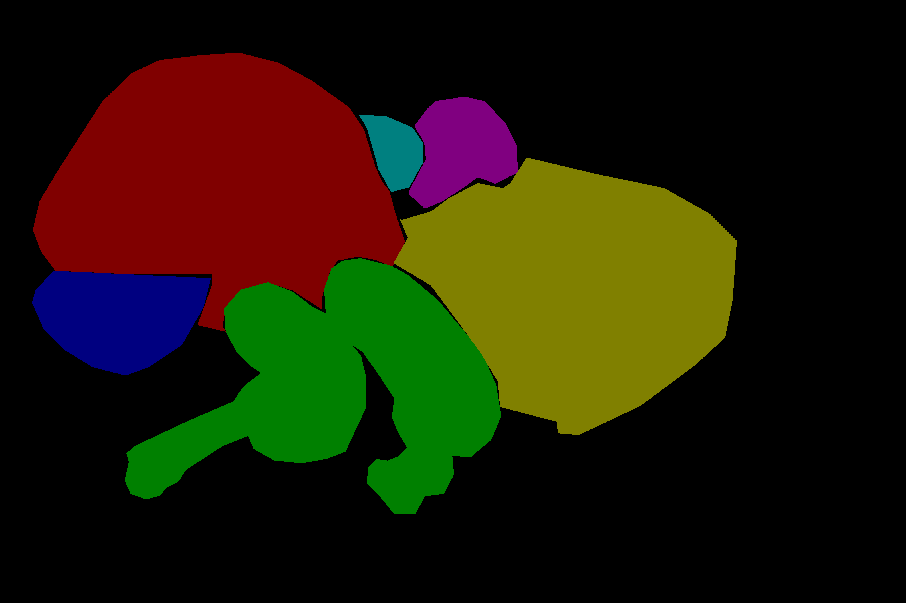
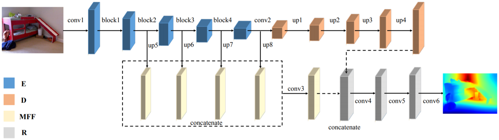
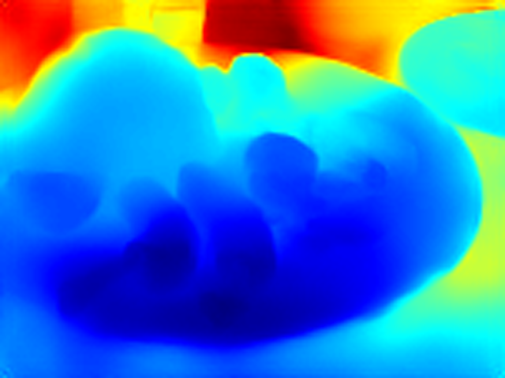

# End-to-End Multi-view Supervision for Single-view Food Volume Estimation

This is the code for Digital Image Processing course project in 2018 Fall to explore food volume estimation, maintained by Kaiwen Zha and Yanjun Fu.

## Overview

[End-to-End Multi-view Supervision for Single-view Food Volume Estimation](#end-to-end-multi-view-supervision-for-single-view-food-volume-estimation)
  - [Overview](#overview)
  - [Food Detection](#food-detection)
    - [Dependencies](#dependencies)
    - [Dataset Preparation](#dataset-preparation)
    - [Training Phase](#training-phase)
    - [Evaluating Phase](#evaluating-phase)
  - [Segmentation Mask](#segmentation-mask)
    - [Dependencies](#dependencies-1)
    - [Training Phase](#training-phase-1)
    - [Evaluating Phase](#evaluating-phase-1)
    - [Results](#results)
  - [Volume Estimation](#volume-estimation)
    - [Dependencies](#dependencies-2)
    - [Preparation](#preparation)
    - [Demo](#demo)
    - [Depth Estimation Results](#depth-estimation-results)
    - [Volume Estimation Results](#volume-estimation-results)
  - [Contributors](#contributors)
  - [Acknowledgement](#acknowledgement)

## Food Detection

We conduct food classification on [Food-101](https://www.vision.ee.ethz.ch/datasets_extra/food-101/) dataset (also on [Recipe-1M](http://pic2recipe.csail.mit.edu/) dataset) by finetuning on pretrained Inception-Resnet-V2 models, where training on multiple GPUs in parallel is enabled by tower loss scheme.

### Dependencies

- Python 3.5
- TensorFlow 1.8.0
- Numpy

- Scipy

### Dataset Preparation

Here, we take Food-101 dataset as example, and we also conduct classification on Recipe-1M dataset with similar procedures.

- Download and extract the Food-101 dataset
    ```bash
    mkdir dataset
    cd dataset
    curl http://data.vision.ee.ethz.ch/cvl/food-101.tar.gz
    tar -xzf food-101.tar.gz
    cd ..
    ```

- Convert the dataset into TFrecord files for easily feeding into data pipeline
    ```bash
    cd src
    python3 convert_dataset.py --tfrecord_filename=foods --dataset_dir="../dataset/food-101/images"
    cd ..
    ```

### Training Phase

- Download Inception-ResNet-V2 pretrained model 
- Run the model training phase
    ```bash
    python model.py --model=pretrained-inception-resnet-v2 --dataset=../dataset/FOOD101/images
    ```

### Evaluating Phase

- Run the model evaluating phase
    ```bash
    python evaluate.py --model=[Pretrained checkpoint] --dataset=[Evaluating dataset]
    ```

## Segmentation Mask

We use [RefineNet](https://arxiv.org/abs/1611.06612) to segment different food portions from the input image, where we utilize the model pretrained on [PASCAL VOC 2012](http://host.robots.ox.ac.uk/pascal/VOC/) dataset considering that there is no existing large food segmentation dataset, and then we finetune the model with our manually annotated segmentation samples.


### Dependencies

- Python 3.5
- TensorFlow 1.8.0
- Numpy
- OpenCV
- Pillow
- Pickle

### Training Phase

- Convert training data into TFrecord

```bash
python convert_pascal_voc_to_tfrecords.py
```

- Run the model training phase

```bash
python RefineNet/multi_gpu_train.py
```

### Evaluating Phase

- Download the pretrained models from [here](http://pan.baidu.com/s/1kVefEIj)

- Put raw images in demo/ and run the following script to get masks (set the color map first)

```bash
python RefineNet/demo.py
```

### Results

<div align="center">
    
    
</div>

## Volume Estimation

Firstly, we leverage state-of-the-art single image depth estimation method proposed by [Hu et al.](https://arxiv.org/abs/1803.08673) to produce the depth map of an input food image. Due to the lack of existing RGBD food image dataset, we use the model pretrained on [NYU-Depth V2](https://cs.nyu.edu/~silberman/datasets/nyu_depth_v2.html) and obtain relatively promising results. Then, after doing system transformation, with the prior knowledge about the plate diameter, we estimate the volume of each food portion combining with segmentation mask.



### Dependencies

- Python 3.6
- Pytorch 0.4.1
- Numpy
- Matplotlib
- Pillow
- Scipy
- Json

### Preparation

- Download the pretrained model from [here](https://drive.google.com/file/d/1QaUkdOiGpMuzMeWCGbey0sT0wXY0xtsj/view?usp=sharing), and put it on the same directory as the code

### Demo

- If you do not want to use your own images, run the following script

```bash
python demo.py
```

For the image and segmentation json in the /input folder, the model will produce the colorized depth map `out_color.png`, the gray depth map `out_grey.png`, segmentation image `mask.png`, and the volume estimation `out.txt` in folder /output.

- If you want to add your own images, run the following script

```
python demo.py --img /path/to/your/img --json /path/to/your/json --output /path/to/output
```

Note that you need to add segmentation json file (with the same format as [labelme](https://github.com/wkentaro/labelme) annotation) for the image in folder /input, and modify the color maps between food types and colors in `mask.py`.

### Depth Estimation Results

<div align="center">
    
    
</div>

### Volume Estimation Results

<div align="center">
    
    
</div>

<div align="center">
    
    
</div>

- Demonstration
  - Top Left: Raw input image
  - Top Right: Segmentation image
  - Bottom Left: Grey depth map
  - Bottom Right: Colorized depth map
- Volume

```python
Volume:{'rice': 340.0309850402668, 'vegetable': 65.82886736721441, 'chicken': 188.60914207925677} unit: cm^3
```

## Contributors

This repo is maintained by [Kaiwen Zha](https://github.com/KaiwenZha), and [Yanjun Fu](https://github.com/Dynamite321).

## Acknowledgement

Special thanks for the guidance of Prof. Bin Sheng, TA. Yang Wen and TA. Siyuan Pan.